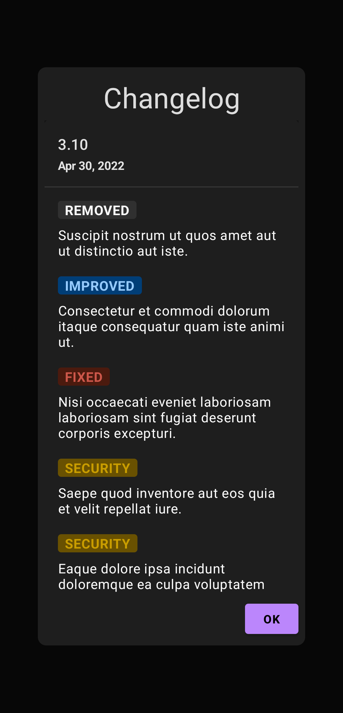

<p align="center">
    
</p>

&nbsp;&nbsp;
<p align="center">
    :star2: <b>Bulletin</b> lets you display a changelog in your app quickly and easily with Jetpack Compose! :star2:
</p>
&nbsp;&nbsp;

&nbsp;&nbsp;
<p align="center">
    &nbsp;&nbsp;&nbsp;&nbsp;&nbsp;&nbsp;&nbsp;&nbsp;
    
</p>
&nbsp;&nbsp;

## Quick Start
In your project-level `build.gradle` file:
```gradle
allprojects {
    repositories {
        mavenCentral()
    }
}
```

In your app or module `build.gradle` file:
```gradle
dependencies {
    implementation("com.tobianoapps:bulletin:1.0.0")
}
```

## Displaying a Bulletin
`Bulletin` lets you provide a changelog:
* via [Kotlin DSL](https://github.com/sebastinto/bulletin#arrow_forward-kotlin-dsl)
* from a [JSON file bundled with your project](https://github.com/sebastinto/bulletin#arrow_forward-local-json)
* [directly from a url](https://github.com/sebastinto/bulletin#arrow_forward-kotlin-dsl)

### :arrow_forward: Kotlin DSL

```kotlin
val sampleBulletin = bulletin {
    releases = listOf(
        Release(
            time = 1652229320349,
            label = "1.0.0-RC2",
            changes = listOf(
                change {
                    changeType = NEW
                    summary = "Bulletin is easy!"
                },
                change {
                    changeType = DEFAULT
                    summary = "Kotlin DSL FTW!"
                }
            )
        ),
        Release(...)
        ...
    )
}

```

Then:

```kotlin
BulletinScreen(bulletin = sampleBulletin)
```


### :arrow_forward: Local JSON
Save a `.json` file in your Android project's `assets` folder then:

```kotlin
BulletinScreen(
    filename = "bulletin.json",
    onError = { /* handle error */ }
    )
```

> Note: implementing the error callback is optional but strongly recommended.

<details> 
    <summary>Click to see JSON format</summary>
    
```JSON
[
   {
      "time":1652229320349,
      "label":"1.0.0-RC2",
      "changes":[
         {
            "changeType":"NEW",
            "summary":"Bulletin is easy!"
         },
         {
            "changeType":"DEFAULT",
            "summary":"Kotlin DSL FTW!"
         }
      ]
   },
   {
    "more..."
   }
]
```
</details>

### :arrow_forward: Remote JSON
Expose a public endpoint that serves `json` data then:

```kotlin
BulletinScreen(
    url = "https://mywebsite.com/api/changelog/",
    onError = { /* handle error */ }
    )
```

> Note: implementing the error callback is optional but strongly recommended.

<details> 
    <summary>Click to see JSON format</summary>
    
```JSON
[
   {
      "time":1652229320349,
      "label":"1.0.0-RC2",
      "changes":[
         {
            "changeType":"NEW",
            "summary":"Bulletin is easy!"
         },
         {
            "changeType":"DEFAULT",
            "summary":"Kotlin DSL FTW!"
         }
      ]
   },
   {
    "more..."
   }
]
```
</details>

To display a custom loading indicator, just pass your own `Composable`:

```kotlin
BulletinScreen(
    url = "https://mywebsite.com/api/changelog/",
    urlLoadingView = { CustomLoadingView() },
    onError = { /* handle error */ }
    )
```

The default HTTP timeout duration of 5 seconds can be customized as follows:

```kotlin
BulletinScreen(
    url = "https://mywebsite.com/api/changelog/",
    timeout = 10000L,
    onError = { /* handle error */ }
    )
```


Check out the sample project for detailed examples.

## Callbacks

`Bulletin` provides callbacks that you can optionally implement.

```kotlin
BulletinScreen(
            ...
            onReleaseHeaderClick = { release ->
                Log.i("TAG", "Release ${release.label} header clicked")
            },
            onChangeClick = { change ->
                Log.i("TAG", "Clicked on \"${change.summary}\"")
            },
            onError = { error ->
                Log.e("TAG", "An error occurred: $error")
            }
        )
```

## Dialog

Although displaying a `Bulletin` as a dialog is left for the user to implement, the sample project includes a demonstration, so make sure to check it out!

&nbsp;&nbsp;
<p align="center">
    &nbsp;&nbsp;&nbsp;&nbsp;&nbsp;&nbsp;&nbsp;&nbsp;
    
</p>
&nbsp;&nbsp;

## Customization

While `Bulletin` is meant to be a quick and easy way to display a changelog in your app (with light and dark modes supported out-of-the box), the library also provides some extensive customization options. 

&nbsp;&nbsp;
<p align="center">
    &nbsp;&nbsp;&nbsp;&nbsp;&nbsp;&nbsp;&nbsp;&nbsp;
    
    </br>
    &nbsp;&nbsp;&nbsp;&nbsp;&nbsp;&nbsp;&nbsp;&nbsp;
    
</p>
&nbsp;&nbsp;

### BulletinConfig

To customize a `Bulletin`'s attributes, simply implement a custom `BulletinConfig`. You can choose to implement as few or as many custom attributes as desired. 

```kotlin
val customBulletinConfig = bulletinConfig {
    bulletinColors = customBulletinColors
    style = customBulletinStyle
    groupByChangeType = true
    showHeaderDivider = false
    showReleaseDate = true
    zoneId = ZoneId.of("Europe/Paris")
    locale = Locale.FRANCE
}

val customBulletinStyle = bulletinStyle {
    cardStyle = customCardStyle
    tagStyle = customTagStyle
}

fun cardDateStyle(): TextStyle = TextStyle(
    color = Color.Blue,
    fontWeight = FontWeight.Thin,
    fontStyle = FontStyle.Italic
)

fun cardTitleStyle(): TextStyle = TextStyle(
    color = Color.Green,
    fontSize = 23.sp,
    fontWeight = FontWeight.Bold
)

val customCardStyle = bulletinCardStyle {
    shape = CutCornerShape(8.dp)
    elevation = 10.dp
    paddingHorizontal = 34.dp
    verticalSpacing = 32.dp
    cardDateStyle = {
        if (isSystemInDarkTheme())
            cardDateStyle().copy(color = Color.White)
        else
            cardDateStyle()
    }
    cardTitleStyle = {
        if (isSystemInDarkTheme())
            cardTitleStyle().copy(color = Color.LightGray)
        else
            cardTitleStyle()
    }
    borderStroke = BorderStroke(width = 3.dp, color = Color.DarkGray)
}

val customTagStyle = bulletinTagStyle {
   // custom values
}

// more custom values
```

Then:

```kotlin
Bulletin(
    ...
    bulletin = sampleBulletin,
    bulletinConfig = customBulletinConfig
    ...
    )
```

A complete implementation of a `BulletinConfig` is included in the sample project.

### Change type labels


To override the strings used on the change type labels, simply provide your custom implementation in your project's `strings.xml` file:

```xml
<resources>
    <string name="change_type_default">misc</string>
    <string name="change_type_improved">enhanced</string>
    <string name="change_type_fixed">bug</string>
    <string name="change_type_maintenance">these can be anything</string>
    <string name="change_type_new">🚀</string>
    <string name="change_type_removed">gone</string>
    <string name="change_type_deprecated">obsolete</string>
    <string name="change_type_security">notice</string>
</resources>
```

</br></br></br></br></br>

## Contributions

Contributions, suggestions, bug reports are welcomed. Keep in mind that this is developed in my spare time, which means limited time can be dedicated to the project. I'll do my best to fix bugs but new features may not be added.
